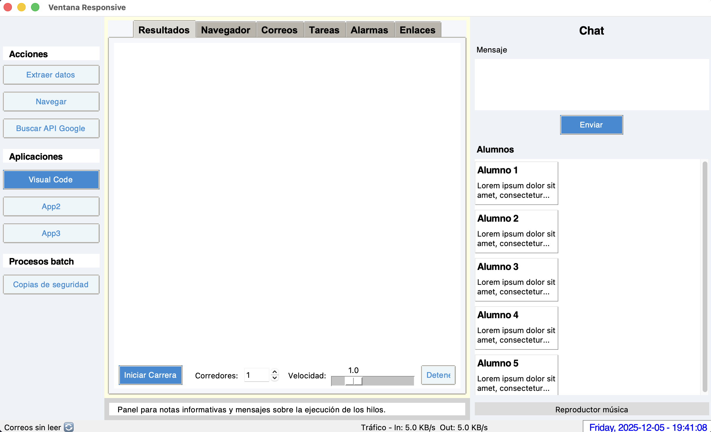

# Proyecto PSP — Interfaz de utilidades (Tkinter)

Enlace al video explicativo de la interfaz
------------------------------------------
Descarga: https://we.tl/t-IvY8pi641e Expira el 11 de diciembre
YouTube: https://youtu.be/z6CQhWgzbgs



Descripción
-----------
Aplicación de escritorio en Python que agrupa varias utilidades en una sola interfaz:
navegador, scraping, monitor de recursos, copias de seguridad, reproductor de audio,
alarmas y una mini‑app (carreras). La GUI está implementada con Tkinter y aprovecha
módulos opcionales para funcionalidades avanzadas.

Estructura del repositorio
--------------------------
- `proyecto.py` — Código fuente principal con la GUI y todas las utilidades.
- `backup/` — Carpeta destino para copias de seguridad generadas por la app.
- `scrapping/` — Carpeta donde se guardan resultados de scraping.
- `__pycache__/` — Caché de Python (no versionar).

Requisitos
----------
- Python 3.8+
- Dependencias requeridas:
  - psutil
- Dependencias opcionales (habilitan funcionalidades extra):
  - requests, beautifulsoup4 — scraping y OpenWeather
  - matplotlib — monitor de recursos en ventana gráfica
  - pygame — reproducción de audio local (fallback a `afplay` en macOS)

Instalación (recomendado con entorno virtual)
----------------------------------------------
```sh
python -m venv .venv
# macOS / Linux
source .venv/bin/activate
# Windows PowerShell
.venv\Scripts\Activate.ps1

pip install --upgrade pip
pip install psutil
# opcionales según uso:
pip install requests beautifulsoup4 matplotlib pygame
```

Ejecución
---------
```sh
python proyecto.py
```
La aplicación abrirá la ventana principal; desde ella se accede a todas las utilidades.

Características principales
---------------------------
- Visualización y actualización de fecha/hora: función [`proyecto.update_time`](proyecto.py)
- Abrir navegador (directo o por diálogo): [`proyecto.launch_browser`](proyecto.py), [`proyecto.launch_browser_prompt`](proyecto.py)
- Ejecutar script PowerShell y backup de archivos/carpetas: [`proyecto.run_backup_script`](proyecto.py), [`proyecto._copy_path_to_backup`](proyecto.py), [`proyecto.backup_ui`](proyecto.py)
- Scraping web y guardado en `scrapping/`: [`proyecto.scrape_url`](proyecto.py)
- Consulta OpenWeather (persistencia de API key): [`proyecto.fetch_weather_xabia`](proyecto.py), borrar key con [`proyecto.clear_openweather_key`](proyecto.py)
- Monitor de recursos con matplotlib (si instalado): [`proyecto.open_resource_window`](proyecto.py)
- Reproductor de música (pygame o afplay): [`proyecto.play_music_file`](proyecto.py), parada con [`proyecto.stop_music`](proyecto.py)
- Alarmas programables: [`proyecto.set_alarm_minutes`](proyecto.py), cancelar con [`proyecto.cancel_alarm`](proyecto.py)
- Juego de carreras (canvas): [`proyecto.open_game_race`](proyecto.py)
- Abrir aplicaciones macOS con `open`: [`proyecto.launch_app`](proyecto.py)
- Monitor de red en la barra de estado: [`proyecto.network_monitor`](proyecto.py)

Configuración y datos sensibles
-------------------------------
- OpenWeather API key (opcional) se guarda en:
  `$HOME/.config/proyecto/openweather.key`  
  Usa la opción "Borrar OpenWeather Key" en la UI o la función [`proyecto.clear_openweather_key`](proyecto.py) para eliminarla.
- Carpetas `backup/` y `scrapping/` se crean automáticamente al usar las utilidades correspondientes.

Buenas prácticas y recomendaciones
----------------------------------
- Añadir `.gitignore` para excluir `__pycache__/`, `.venv/` y ficheros de configuración local.
- Mantener un `requirements.txt` o `pyproject.toml` para el control de dependencias.
- Separar funcionalidades en módulos (p. ej. `ui.py`, `utils/backup.py`, `utils/scrape.py`) para mejorar mantenibilidad.
- Añadir tests unitarios y/o pruebas de integración manuales para las utilidades críticas.

Propuestas de archivo adicional sugerido
---------------------------------------
- `.gitignore` (ejemplo mínimo):
```
__pycache__/
.venv/
*.pyc
*.key
```

- `requirements.txt` (sugerido):
```
psutil
requests
beautifulsoup4
matplotlib
pygame
```

Contribuir
----------
1. Abrir un issue describiendo el bug o la mejora.
2. Hacer fork y branch con nombre descriptivo.
3. Añadir cambios y pruebas manuales.
4. Enviar pull request con descripción y pasos para reproducir.

Solución de problemas comunes
-----------------------------
- Si falta `matplotlib` verás advertencia: instala `pip install matplotlib`.
- Para reproducción de audio en macOS se usa `afplay` como fallback; en Linux/Windows proporciona `pygame`.
- Si la consulta a OpenWeather devuelve 401, la app pregunta si quieres borrar la key persistida y reintroducirla.

Licencia
--------
Añade un archivo `LICENSE` según la política del proyecto (ej. MIT, Apache‑2.0).

Contacto
--------
Abrir un issue en este repositorio para dudas técnicas o propuestas de mejora.
